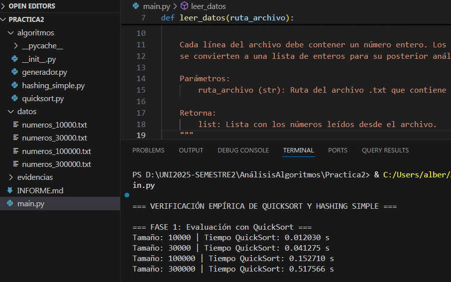
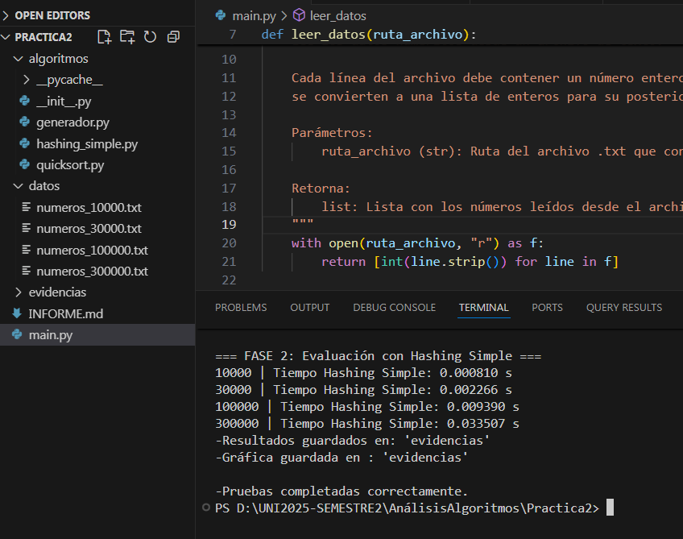
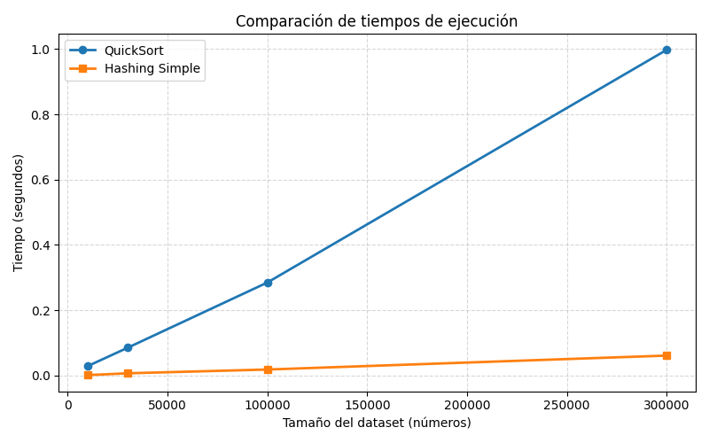

# UNIVERSIDAD DA VINCI DE GUATEMALA
## Facultad de Ingeniería Industria y Tecnología

# PRÁCTICA 2: Verificación Empírica de QuickSort y Hashing Simple

**Curso:** Administración de Sistemas Operativos y DEVOPS.  
**Estudiante:**  Kevin Alberto Tinay Pérez.  
**Carné:**  202304533.   
**Fecha de Entrega:** 04/02/2026

## 2. Objetivos

### Objetivo General

Aplicar lo aprendido en el curso de análisis de algoritmos con el fin de comparar los resultados del ejecución de Quicksort y Hashing Simple, utilizando un medidor de tiempo de ejecución para evaluar el rendimiento y su eficiencia dandole como entrada diferente cantidad de datos.

### Objetivos Específicos
* Analizar el comportamiento empírico de QuickSort y Hashing Simple con distintos volúmenes de entrada.
* Medir y comparar los tiempos de ejecución reales de ambos algoritmos.
* Documentar los resultados, evidencias gráficas y conclusiones de forma estructurada.
---
## 3. Marco Teórico.

### QuickSort
QuickSort es un algoritmo de ordenamiento basado en el paradigma divide y vencerás.
Selecciona un pivote, divide la lista en sublistas menores y mayores al pivote, y ordena cada una recursivamente.
En promedio tiene una complejidad de O(n log n), aunque en el peor caso puede alcanzar O(n²).

### Hashing Simple (con Encadenamiento)
El hashing simple es una técnica de almacenamiento que utiliza una función hash para determinar la posición de un elemento dentro de una tabla.
Se aplica el operador módulo (%) para calcular el índice, y en caso de colisiones se utiliza sondeo lineal para encontrar una celda vacía.
Su rendimiento promedio es O(1) para inserciones y búsquedas.  

---

## 4. Metodología

* **Lenguaje:** Python 3.11
* **Bibliotecas:** time, matplotlib, csv
* **Equipo:**
    - **Procesador:** Intel Core i7 13620H
    - **RAM:** 32GB
    - **GPU:** NVIDIA RTX 4050
    - **SO:** Windows 11
* **IDE:** Visual Studio Code (VS Code)

### Datasets
Los datos de entrada se generaron con números aleatorios, un número por línea, leídos desde archivos `.txt` en la carpeta `datos/`.
* **Tamaños ($N$):** 10,000, 30,000, 100,000 y 300,000.

---
### Tabla de Resultados:
Durante la ejecución, se midieron los tiempos en segundos usando time.perf_counter().

| Archivo| N (Tamaño del Dataset) | QuickSort (s) | Hashing (s) |
| :---:   |:---:    | :---:    | :---:    |
| numeros_10000.txt | 10,000  | 0.012030 | 0.000810 |
| numeros_30000.txt | 30,000  | 0.041275 | 0.002266 |
| numeros_100000.txt| 100,000 | 0.152710 | 0.009390 |
| numeros_300000.txt| 300,000 | 0.517566 | 0.033507 |
---

### Imágenes Evidencias:

**Ejecución de QuickSort:**

- QuickSort muestra un incremento progresivo del tiempo conforme aumenta el tamaño del dataset, lo cual concuerda con su complejidad promedio de O(n log n).   
- Aunque el tiempo se incrementa con el tamaño de los datos, el crecimiento no es exponencial, sino moderado, evidenciando su eficiencia frente a otros algoritmos de ordenamiento cuadráticos como BubbleSort o InsertionSort.

**Ejecución de Hashing Simple:**

- Los tiempos de ejecución son muy pequeños y crecen muy lentamente respecto al tamaño de los datos. Esto confirma que el hashing tiene una complejidad promedio O(1), tanto para inserciones como para búsquedas.
- Aun con 300,000 elementos, el tiempo de ejecución apenas llega a 0.033 segundos, lo cual demuestra su eficiencia extrema para operaciones de acceso directo.

### Gráfica Comparativa de Tiempos:

- QuickSort es ideal para ordenar grandes conjuntos de datos, mientras que Hashing Simple es óptimo para almacenar y acceder rápidamente a la información.
Ambos algoritmos son eficientes, pero su utilidad depende del objetivo: ordenamiento vs búsqueda directa.

---

### Conclusiones:
1. Los resultados experimentales confirman la complejidad teórica de ambos algoritmos: QuickSort presenta un crecimiento logarítmico y Hashing Simple mantiene tiempos casi constantes.

2. QuickSort demuestra ser un método de ordenamiento altamente eficiente incluso con cientos de miles de elementos, mientras que Hashing Simple destaca por su rapidez y bajo costo temporal.

3. El rendimiento de QuickSort crece de forma controlada a medida que aumenta el tamaño del dataset, mientras que Hashing mantiene una escalabilidad prácticamente constante.

4. QuickSort es preferible cuando el objetivo es ordenar o clasificar datos.

5. Hashing Simple es preferible cuando se requiere acceso directo o búsqueda rápida.  

- Conclusión general:  
Ambos algoritmos cumplen propósitos distintos, pero su comportamiento empírico demuestra que, cuando se aplican correctamente, son herramientas potentes y eficientes en el análisis y manejo de grandes volúmenes de datos.